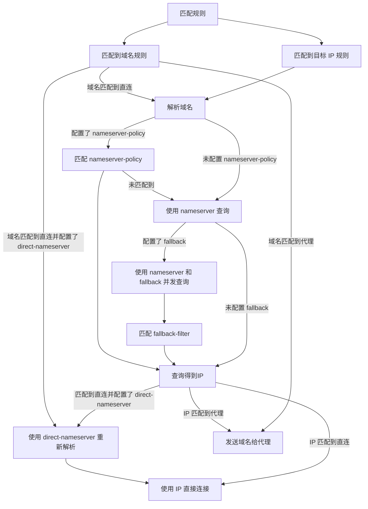

# mihomo (MetaCubeX) DNS 配置完整指南

> 来源：[https://wiki.metacubex.one/config/dns/](https://wiki.metacubex.one/config/dns/)
>
> 整理日期：2026-06-10

---

## 目录

- [1. 完整配置模板](#1-完整配置模板)
- [2. DNS 支持的类型](#2-dns-支持的类型)
- [3. 核心参数详解](#3-核心参数详解)
  - [3.1 enable](#31-enable)
  - [3.2 cache-algorithm](#32-cache-algorithm)
  - [3.3 prefer-h3](#33-prefer-h3)
  - [3.4 listen](#34-listen)
  - [3.5 ipv6](#35-ipv6)
  - [3.6 enhanced-mode](#36-enhanced-mode)
  - [3.7 fake-ip-range](#37-fake-ip-range)
  - [3.8 fake-ip-range6](#38-fake-ip-range6)
  - [3.9 fake-ip-filter](#39-fake-ip-filter)
  - [3.10 fake-ip-filter-mode](#310-fake-ip-filter-mode)
  - [3.11 fake-ip-ttl](#311-fake-ip-ttl)
  - [3.12 use-hosts](#312-use-hosts)
  - [3.13 use-system-hosts](#313-use-system-hosts)
  - [3.14 respect-rules](#314-respect-rules)
- [4. DNS 服务器配置层级](#4-dns-服务器配置层级)
  - [4.1 default-nameserver](#41-default-nameserver)
  - [4.2 nameserver-policy](#42-nameserver-policy)
  - [4.3 nameserver](#43-nameserver)
  - [4.4 fallback](#44-fallback)
  - [4.5 proxy-server-nameserver](#45-proxy-server-nameserver)
  - [4.6 proxy-server-nameserver-policy](#46-proxy-server-nameserver-policy)
  - [4.7 direct-nameserver](#47-direct-nameserver)
  - [4.8 direct-nameserver-follow-policy](#48-direct-nameserver-follow-policy)
- [5. fallback-filter（防污染过滤器）](#5-fallback-filter防污染过滤器)
  - [5.1 geoip](#51-geoip)
  - [5.2 geoip-code](#52-geoip-code)
  - [5.3 geosite](#53-geosite)
  - [5.4 ipcidr](#54-ipcidr)
  - [5.5 domain](#55-domain)
- [6. 附加参数](#6-附加参数)
  - [6.1 DNS 指定代理/接口进行连接](#61-dns-指定代理接口进行连接)
  - [6.2 h3](#62-h3)
  - [6.3 skip-cert-verify](#63-skip-cert-verify)
  - [6.4 ecs](#64-ecs)
  - [6.5 ecs-override](#65-ecs-override)
  - [6.6 disable-ipv4](#66-disable-ipv4)
  - [6.7 disable-ipv6](#67-disable-ipv6)
  - [6.8 disable-qtype-int](#68-disable-qtype-int)
- [7. hosts 配置](#7-hosts-配置)
- [8. DNS 解析流程](#8-dns-解析流程)
- [9. 推荐配置方案（国内用户）](#9-推荐配置方案国内用户)
- [10. 注意事项](#10-注意事项)

---

## 1. 完整配置模板

```yaml
dns:
  enable: true
  cache-algorithm: arc
  prefer-h3: false
  use-hosts: true
  use-system-hosts: true
  respect-rules: false
  listen: 0.0.0.0:1053
  ipv6: false
  default-nameserver:
    - 223.5.5.5
  enhanced-mode: fake-ip
  fake-ip-range: 198.18.0.1/16
  # fake-ip-range6: fdfe:dcba:9876::1/64
  fake-ip-filter-mode: blacklist
  fake-ip-filter:
    - '*.lan'
  # fake-ip-ttl: 1
  nameserver-policy:
    '+.arpa': '10.0.0.1'
    'rule-set:cn':
      - https://doh.pub/dns-query
      - https://dns.alidns.com/dns-query
  nameserver:
    - https://doh.pub/dns-query
    - https://dns.alidns.com/dns-query
  fallback:
    - tls://8.8.4.4
    - tls://1.1.1.1
  proxy-server-nameserver:
    - https://doh.pub/dns-query
  proxy-server-nameserver-policy:
    'www.yournode.com': '114.114.114.114'
  direct-nameserver:
    - system
  direct-nameserver-follow-policy: false
  fallback-filter:
    geoip: true
    geoip-code: CN
    geosite:
      - gfw
    ipcidr:
      - 240.0.0.0/4
    domain:
      - '+.google.com'
      - '+.facebook.com'
      - '+.youtube.com'
```

---

## 2. DNS 支持的类型

mihomo 支持以下 DNS 协议类型：

### UDP

```yaml
- 223.5.5.5
# 或
- udp://223.5.5.5
```

### TCP

```yaml
- tcp://8.8.8.8
```

### DNS over TLS (DoT)

```yaml
- tls://1.1.1.1
```

### DNS over HTTPS (DoH)

```yaml
- https://doh.pub/dns-query
```

### DNS over QUIC (DoQ)

```yaml
- quic://dns.adguard.com:784
```

### system（系统 DNS）

```yaml
- system://
# 或
- system
```

### dhcp

```yaml
# 指定网卡接口
- dhcp://en0

# 仅限 cmfa，使用系统 dns
- dhcp://system
```

### rcode（返回码）

```yaml
- rcode://success            # No error
- rcode://format_error       # Format error
- rcode://server_failure     # Server failure
- rcode://name_error         # Non-existent domain
- rcode://not_implemented    # Not implemented
- rcode://refused            # Query refused
```

---

## 3. 核心参数详解

### 3.1 enable

是否启用 DNS 模块。如为 `false`，则使用系统 DNS 解析。

### 3.2 cache-algorithm

支持的算法：


| 算法    | 全称                         | 说明             |
| ----- | -------------------------- | -------------- |
| `lru` | Least Recently Used        | 最近最少使用，**默认值** |
| `arc` | Adaptive Replacement Cache | 自适应替换缓存        |


### 3.3 prefer-h3

DOH 是否优先使用 HTTP/3。

> ⚠️ 强烈不建议和 `respect-rules` 一起使用。

### 3.4 listen

DNS 服务监听地址，支持 UDP 和 TCP。例如 `0.0.0.0:1053`。

### 3.5 ipv6

是否解析 IPv6。如为 `false`，则回应 AAAA 的空解析。

### 3.6 enhanced-mode

mihomo 的 DNS 处理模式。


| 模式           | 说明                               |
| ------------ | -------------------------------- |
| `fake-ip`    | 返回虚假 IP，连接时再通过映射获取真实 IP，**性能最佳** |
| `redir-host` | 传统的真实 IP 模式，兼容性更好，**默认值**        |


**推荐使用 `fake-ip` 模式**，响应更快，延迟更低。

### 3.7 fake-ip-range

fake-ip 下的 IPv4 地址段设置。**TUN 的默认 IPv4 地址也使用此值作为参考。**

例如：`198.18.0.1/16`

### 3.8 fake-ip-range6

fake-ip 下的 IPv6 地址段设置。

例如：`fdfe:dcba:9876::1/64`

### 3.9 fake-ip-filter

fake-ip 过滤列表。匹配到的域名不会下发 fake-ip 映射，而是返回真实 IP 用于连接。

值支持**域名通配**以及**引入域名集合**。

### 3.10 fake-ip-filter-mode

可选值 `blacklist` / `whitelist` / `rule`，默认 `blacklist`。


| 模式          | 说明                        |
| ----------- | ------------------------- |
| `blacklist` | 列表中的域名**不返回** fake-ip（默认） |
| `whitelist` | **只有**列表中的域名才返回 fake-ip   |
| `rule`      | 规则模式，支持更灵活的匹配语法           |


#### rule 模式示例

当 `fake-ip-filter-mode` 设置为 `rule` 时，`fake-ip-filter` 的写法发生改变：

```yaml
dns:
  fake-ip-filter-mode: rule
  fake-ip-filter:
    # 与路由 rules 匹配逻辑一致（自上而下），支持 GEOSITE、RuleSet、DOMAIN*、MATCH
    - RULE-SET,reject-domain,fake-ip    # RuleSet behavior 必须为 domain/classical
    - RULE-SET,proxy-domain,fake-ip
    - GEOSITE,gfw,fake-ip
    - DOMAIN,www.baidu.com,real-ip
    - DOMAIN-SUFFIX,qq.com,real-ip
    - DOMAIN-SUFFIX,jd.com,fake-ip
    - MATCH,fake-ip                      # 最终兜底：fake-ip 或 real-ip
```

> 当 RuleSet behavior 为 `classical` 时，仅会生效域名类规则。

### 3.11 fake-ip-ttl

配置 fake-ip 查询返回的 TTL 值。

> ⚠️ 非必要情况下请勿修改。

### 3.12 use-hosts

是否回应配置中的 hosts，默认 `true`。

### 3.13 use-system-hosts

是否查询系统 hosts，默认 `true`。

### 3.14 respect-rules

DNS 连接遵守路由规则，需配置 `proxy-server-nameserver`。

> ⚠️ 强烈不建议和 `prefer-h3` 一起使用。

---

## 4. DNS 服务器配置层级

DNS 解析的优先级顺序（从高到低）：

```
nameserver-policy > proxy-server-nameserver（节点域名）
> nameserver + fallback（并发查询 + fallback-filter 判定）
> direct-nameserver（直连出口重新解析）
```

### 4.1 default-nameserver

默认 DNS，用于**解析 DNS 服务器自身的域名**（例如 DOH 服务器的域名）。

- **必须为 IP 地址**，但可为加密 DNS
- 建议填写国内公共 DNS：`223.5.5.5`、`119.29.29.29`

```yaml
default-nameserver:
  - 223.5.5.5
```

### 4.2 nameserver-policy

指定域名查询的解析服务器，**优先级最高**，优先于 `nameserver` / `fallback` 查询。

- 键支持 geosite、域名通配（`+.`）
- 值支持字符串或数组

```yaml
nameserver-policy:
  '+.arpa': '10.0.0.1'
  'rule-set:cn':
    - https://doh.pub/dns-query
    - https://dns.alidns.com/dns-query
```

### 4.3 nameserver

默认的域名解析服务器。

```yaml
nameserver:
  - https://doh.pub/dns-query
  - https://dns.alidns.com/dns-query
```

### 4.4 fallback

后备域名解析服务器，一般情况下使用**境外 DNS**，保证结果可信。

配置 `fallback` 后默认启用 `fallback-filter`，`geoip-code` 默认为 `CN`。

```yaml
fallback:
  - tls://8.8.4.4
  - tls://1.1.1.1
```

### 4.5 proxy-server-nameserver

代理节点域名解析服务器，**仅用于解析代理节点的域名**。

如果不填则遵循 `nameserver-policy` → `nameserver` → `fallback` 的配置。

> 💡 防止「鸡蛋问题」：节点域名需要解析才能连接代理，但代理连接后才能解析。

```yaml
proxy-server-nameserver:
  - https://doh.pub/dns-query
```

### 4.6 proxy-server-nameserver-policy

格式同 `nameserver-policy`，仅用于节点域名解析。**当且仅当** `proxy-server-nameserver` 不为空时生效。

```yaml
proxy-server-nameserver-policy:
  'www.yournode.com': '114.114.114.114'
```

### 4.7 direct-nameserver

用于 `direct` 出口（直连）域名解析的 DNS 服务器。如果不填则遵循 `nameserver-policy` → `nameserver` → `fallback` 的配置。

> 📌 direct-nameserver 重新解析在 v1.19.10 后同样应用于 UDP 连接（对于 TUN 入站仅限 Fakeip 模式下）。

```yaml
direct-nameserver:
  - system
```

### 4.8 direct-nameserver-follow-policy

是否遵循 `nameserver-policy`，默认为不遵守（`false`）。仅当 `direct-nameserver` 不为空时生效。

```yaml
direct-nameserver-follow-policy: false
```

---

## 5. fallback-filter（防污染过滤器）

配置 `fallback` 后默认启用，用于判断 `nameserver` 返回的结果是否被 DNS 污染。

满足条件的将使用 `fallback` 结果或只使用 `fallback` 解析。

```yaml
fallback-filter:
  geoip: true
  geoip-code: CN
  geosite:
    - gfw
  ipcidr:
    - 240.0.0.0/4
  domain:
    - '+.google.com'
    - '+.facebook.com'
    - '+.youtube.com'
```

### 5.1 geoip

是否启用 GeoIP 判断。

### 5.2 geoip-code

可选值为国家缩写，默认值为 `CN`。

- 除了 `geoip-code` 配置的国家 IP，其他的 IP 结果会被视为**污染**
- `geoip-code` 配置的国家的结果会**直接采用**，否则将采用 `fallback` 结果

### 5.3 geosite

可选值为对应的 geosite 内包含的集合。

- geosite 列表的内容被视为**已污染**
- 匹配到 geosite 的域名，将**只使用 `fallback` 解析**，不去使用 `nameserver`

### 5.4 ipcidr

书写内容为 `IP/掩码`。

这些网段的结果会被视为污染，`nameserver` 解析出这些结果时将会采用 `fallback` 的解析结果。

### 5.5 domain

这些域名被视为已污染。匹配到这些域名，会直接使用 `fallback` 解析，不去使用 `nameserver`。

---

## 6. 附加参数

此部分可用于发向公网地址的 DNS 服务器，使用 `#` 附加，使用 `&` 连接不同的参数。

除了指定代理/接口和 ecs，其余项的值均为 bool（true/false）。

### 示例

```yaml
dns:
  nameserver:
    - 'https://8.8.8.8/dns-query#proxy&ecs=1.1.1.1/24&ecs-override=true'
proxies:
  - name: proxy
    type: ss
```

### 6.1 DNS 指定代理/接口进行连接

使用 `#proxy` 或 `#接口名` 指定通过代理/网络接口连接。

- 优先使用已有代理，如果不存在该名称的代理则指定接口连接
- `#RULES` 为遵守路由规则进行连接，等同于 `respect-rules`

> 💡 如需经过代理查询，应配置 `proxy-server-nameserver`，以防出现鸡蛋问题。

### 6.2 h3

强制 HTTP/3。

此选项与 `prefer-h3` 不冲突，填写后强制启用 HTTP/3 建立 DOH 连接。使用前需确保 DOH 服务器支持 HTTP/3。

### 6.3 skip-cert-verify

跳过 TLS 证书验证。

### 6.4 ecs

指定 DNS 查询的 subnet 地址。

### 6.5 ecs-override

强制覆盖 DNS 查询的 subnet 地址。

### 6.6 disable-ipv4

丢弃 A 记录回应。

### 6.7 disable-ipv6

丢弃 AAAA 记录回应。

### 6.8 disable-qtype-int

丢弃特定类型的回应。例如 `disable-qtype-65` 可以屏蔽 HTTPS（TYPE65）类型的 DNS 解析。

### 附加参数汇总表


| 参数                     | 说明                         | 值类型  |
| ---------------------- | -------------------------- | ---- |
| `#proxy` / `#接口名`      | 指定通过代理/网络接口连接              | 字符串  |
| `#RULES`               | 遵守路由规则，等同于 `respect-rules` | —    |
| `#h3`                  | 强制 HTTP/3 连接 DOH           | bool |
| `#skip-cert-verify`    | 跳过 TLS 证书验证                | bool |
| `#ecs=<IP/掩码>`         | 指定 DNS 查询的 subnet 地址       | 字符串  |
| `#ecs-override=true`   | 强制覆盖 subnet 地址             | bool |
| `#disable-ipv4`        | 丢弃 A 记录回应                  | bool |
| `#disable-ipv6`        | 丢弃 AAAA 记录回应               | bool |
| `#disable-qtype-<int>` | 丢弃特定类型回应                   | —    |


---

## 7. hosts 配置

```yaml
hosts:
  '*.clash.dev': 127.0.0.1
  'alpha.clash.dev': '::1'
  test.com: [1.1.1.1, 2.2.2.2]
  baidu.com: google.com
```

- 键支持**域名通配**
- 值支持字符串/数组，**域名重定向不支持数组**

> 📌 完整的域名优先级高于使用通配符的域名，例如：
> `foo.example.com` > `*.example.com` > `.example.com`

---

## 8. DNS 解析流程

### 示例配置

```yaml
dns:
  nameserver:
    - https://doh.pub/dns-query
  fallback:
    - https://8.8.8.8/dns-query
  direct-nameserver:
    - system
  nameserver-policy:
    "geosite:cn,private":
      - https://doh.pub/dns-query
      - https://dns.alidns.com/dns-query
  fallback-filter:
    geoip: true
    geoip-code: CN
    geosite:
      - gfw
    ipcidr:
      - 240.0.0.0/4
    domain:
      - '+.google.com'
      - '+.facebook.com'
      - '+.youtube.com'

rules:
  - DOMAIN-SUFFIX,google.com,PROXY
  - GEOIP,CN,DIRECT
  - MATCH,PROXY
```

### 解析流程图



### 流程说明

1. **匹配规则**：流量首先经过路由规则匹配，区分域名规则和 IP 规则
2. **域名匹配到直连**：需要解析域名，如果配置了 `direct-nameserver` 则使用它重新解析
3. **解析域名**：
  - 如果配置了 `nameserver-policy`，先匹配策略
  - 未匹配到策略或未配置策略，则使用 `nameserver` 查询
  - 如果配置了 `fallback`，则 `nameserver` 和 `fallback` **并发查询**
  - 查询结果经 `fallback-filter` 判断是否被污染
4. **发送到代理/直连**：
  - 匹配到代理 → 发送域名给代理服务器
  - 匹配到直连 → 使用解析得到的 IP 直接连接

> 📌 direct-nameserver 重新解析在 v1.19.10 后同样应用于 UDP 连接（对于 TUN 入站仅限 Fakeip 模式下）。

---

## 9. 推荐配置方案（国内用户）

兼顾**解析速度**（国内 DOH）、**防污染**（fallback + filter）和**节点可达性**（独立的 proxy-server-nameserver）。

```yaml
dns:
  enable: true
  cache-algorithm: arc
  listen: 0.0.0.0:1053
  ipv6: false
  default-nameserver:
    - 223.5.5.5
    - 119.29.29.29
  enhanced-mode: fake-ip
  fake-ip-range: 198.18.0.1/16
  fake-ip-filter-mode: blacklist
  fake-ip-filter:
    - '*.lan'
    - 'localhost.ptlogin2.qq.com'
  nameserver:
    - https://doh.pub/dns-query
    - https://dns.alidns.com/dns-query
  fallback:
    - tls://8.8.4.4
    - tls://1.1.1.1
  proxy-server-nameserver:
    - https://doh.pub/dns-query
  fallback-filter:
    geoip: true
    geoip-code: CN
    geosite:
      - gfw
```

---

## 10. 注意事项

1. **鸡蛋问题**：如需通过代理查询 DNS，务必配置 `proxy-server-nameserver`，避免节点域名无法解析
2. **respect-rules 与 prefer-h3**：强烈不建议同时使用
3. **fake-ip-ttl**：非必要情况请勿修改
4. **fallback-filter**：配置 `fallback` 后默认生效，`geoip-code` 默认为 `CN`
5. **default-nameserver**：必须为 IP 地址，用于解析其他 DNS 服务器的域名
6. **hosts 优先级**：完整域名 > 通配符域名（`*.example.com` > `.example.com`）
7. **direct-nameserver**：v1.19.10 后同样应用于 UDP 连接（TUN 入站仅限 Fakeip 模式下）

---

> 📖 原始文档：[https://wiki.metacubex.one/config/dns/](https://wiki.metacubex.one/config/dns/)

&nbsp;